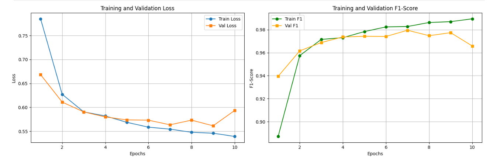
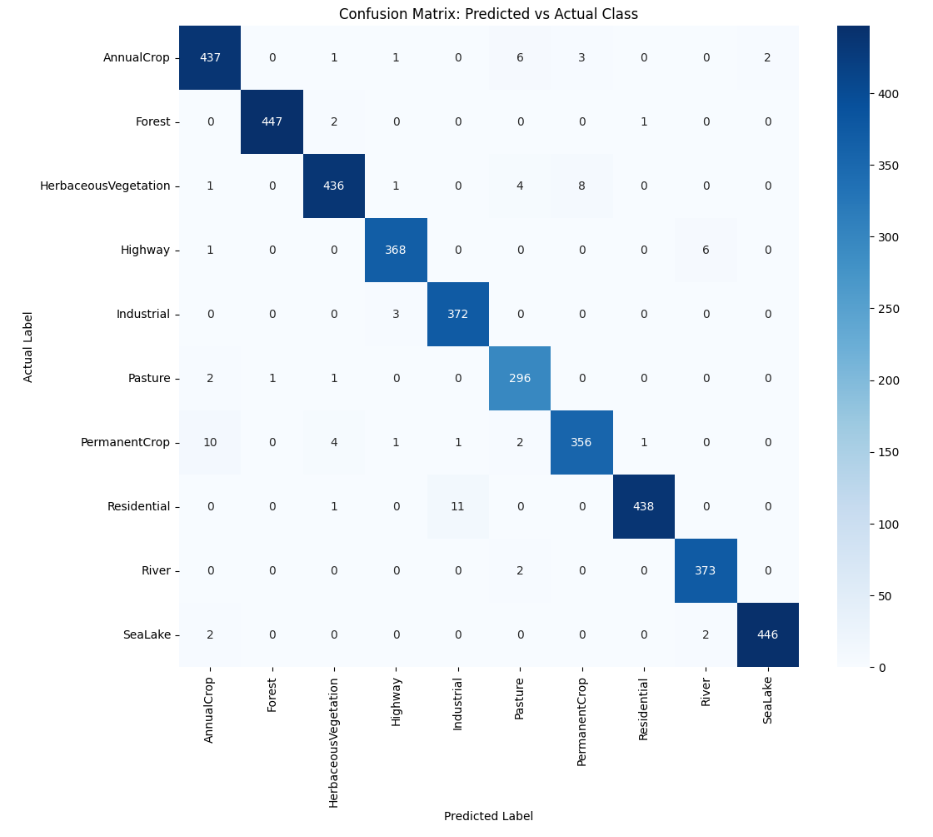
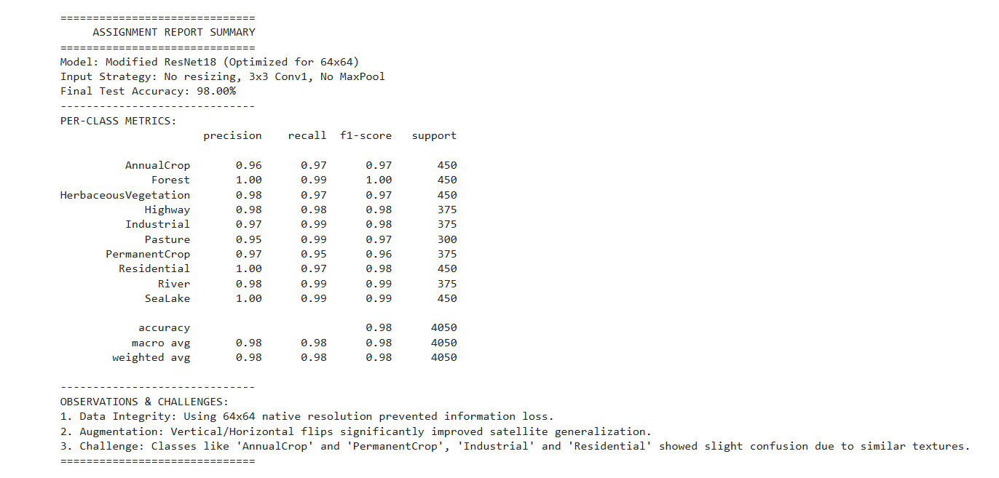

# EuroSAT Land Use Classification using Modified ResNet18

### Project Overview
This project focuses on the automated classification of Sentinel-2 satellite imagery using Deep Learning. Leveraging the **EuroSAT** dataset, I implemented a modified **ResNet18** architecture to classify 10 distinct land-use categories, which is essential for urban planning and environmental monitoring.

### Technical Stack
*   **Deep Learning Framework:** PyTorch
*   **Base Architecture:** ResNet18 (Pre-trained on ImageNet)
*   **Data Processing:** NumPy, Pandas, Matplotlib[cite: 1, 2]
*   **Environment:** Google Colab / Python[cite: 1, 2]

### Methodology
1.  **Transfer Learning:** Utilized the ResNet18 backbone, freezing early layers to leverage pre-trained features while training a custom fully connected layer for 10-class classification.
2.  **Data Augmentation:** Implemented random horizontal/vertical flips and normalization to improve model generalization.
3.  **Optimization:** Used **Cross-Entropy Loss** and the **Adam Optimizer** to achieve high convergence rates during training.

### Results
*   **Accuracy:** 98.00% on the EuroSAT test set.
*   **Application:** This model can be integrated into GIS workflows to automate land-cover mapping for housing societies.

